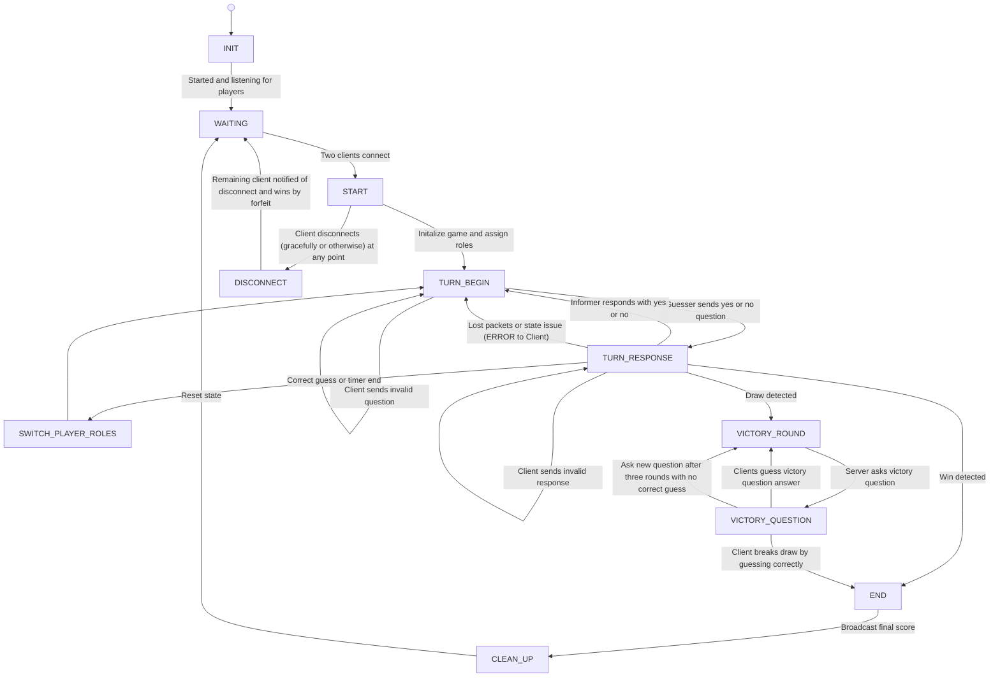

# CS 457 Project Statement of Work (SOW) & Protocol Specification Template

**Student Name:** Sami Conca
**Date:** 2026-09-20
**Course:** CS 457 - Computer Networks and the Internet
**Target Server Domain:** `server.conca.edu`  

---

## 1. Game Selection & Scope (Sprint 0)

### 1.1 Game Overview
- **Chosen Game:** Headbands
- **Player Capacity:** 2 Players (Simulated via 2 CML Client nodes)
- **Game Summary:** In Headbands, Player 1 is randomly assigned a thing: this may be an animal, food, item, or other similar one-word object. Player 2 is told what the thing is. Player 1 must then ask yes or no questions to Player 2 to determine what thing they have been assigned. Player 2 may only respond with "yes" or "no" to Player 1's questions. If Player 1 guesses what they have been assigned before the timer runs out, they receive a point. The roles then switch.

### 1.2 Core Game Rules & Win/Draw Conditions
- **Turn Mechanics:** Player 1 and Player 2 are randomly assigned to the clients. Player 1 must guess what thing they have been assigned before the timer runs out. If they guess correctly, they get a point and the turn moves to Player 2. If the timer runs out, they do not receive a point and the turn moves to Player 2. This continues for some set number of rounds, with points tallied over the whole game.
- **Victory Condition:** A player wins the game by ending with the most number of points. Points are accrued over the entire game and the state is maintained until the end. A point is awarded for guessing the correct answer. No points are awarded for failing to guess the correct answer in the allotted time.
- **Draw/Tie Condition:** A tie occurs when both players end with the same number of points. In this case, a series of victory matches will begin, during which both players will be asked the same question in the form of "I am ___. What am I?" with the blank being filled with some unique descriptor of the randomly selected object. Each object in the victory rounds will have three unique "I am..." statements over the course of a short timer. If no player is able to guess the object during that time, another object will be selected and the process will repeat. The first player to guess the object correctly will be awarded one point, thus breaking the tie.

---

## 2. Application-Layer Messaging Protocol Blueprint (Sprint 1 Deliverable)

### 2.1 Message Transport & Serialization Format
- **Transport Protocol:** TCP
- **Serialization Format:** JSON
- **Framing Mechanism:** Newline-delimited (`\n`) JSON payloads

### 2.2 Message Schema Definitions

#### Message Types:
1. `CONNECT` (Client -> Server): Request to join game.
2. `LOBBY_WAIT` (Server -> Client): Notification that server is waiting for Player 2.
3. `GAME_START` (Server -> Clients): Game initiated, assigns inital roles via coinflip (e.g. Player 1 is Guesser, Player 2 is Informer)
4. `ASK` (Client -> Server): Guesser action (i.e. yes or no question).
5. `INFORM` (Client -> Server): Informer action (i.e. yes or no response).
6. `GUESS` (CLients -> Server): Draw condition only; clients perform Guesser action in lightning round.
7. `STATE_UPDATE` (Server -> Clients): Broadcast current point status, time, round, and roles.
8. `DRAW` (Server -> Clients): Begin draw condition round.
9. `GAME_OVER` (Server -> Clients): Victory notification with final scores.
10. `ERROR` (Server -> Client): Invalid move or malformed packet error.
11. `DISCONNECT` (Server -> Client): Sends disconnect message to remaining client.

### Example Newline-Delimited (`n`) Wirestream:
```
{"msg_type":"CONNECT","player_id":"Player_1","timestamp":1727000000}\n{"msg_type":"ASK","player_id":"Player_1","payload":{"question":"Am I an object?"},"timestamp":1727000005}\n{"msg_type":"INFORM","player_id":"Player_2","payload":{"answer":"No"},"timestamp":1727000010}\n
```

#### Example JSON Protocol Schema:
```json
{
  "msg_type": "ASK",
  "player_id": "Player_1",
  "payload": {
    "question": "Am I an object?"
  },
  "timestamp": 1727000005
}
```

---

### 2.3 Game State Machine (FSM) Design (Sprint 1 Deliverable)
### Game State Machine (FSM) Design


---

## 3. Game Behavior & Server Concurrency Architecture (Sprint 2 Deliverable)

### 3.1 Server Concurrency Strategy
- **Architecture Choice:** [Multi-Threading (`threading.Thread`) OR Non-blocking I/O multiplexing (`select.select` / `selectors`)]
- **Synchronization Logic:** Explain how shared game state and client list are thread-safe (e.g. `threading.Lock`) to prevent race conditions during turn processing.

### 3.2 State & Score Synchronization Across Clients
- **Turn Enforcement:** Detail how the server validates active player ID before processing moves and broadcasts updated turn notifications to all clients.
- **Score & Board Synchronization:** Describe how state broadcasts keep client screens synchronized in real time.

---

## 4. Coding & AI Implementation Plan (Sprint 3)

- **Permitted AI Tools:** GitHub Copilot, ChatGPT, Claude, Gemini, and similar coding harness models and AI assisted code writing and debugging tools.
- **AI Prompting & Constraint Strategy:** I plan to not rely on a full coding harness such as Google Antigravity or ClaudeCode. GitHub Copilot is the most AI that I plan to implement in this project, and thus AI promting will not be frequent. If other models are used for debugging or code writing, a file with protocol and FSM specifications, as well as a written desciprtion of the specifications and project goal will be provided, with instructions that suggested code outside of those constraints is unacceptable.
- **Implementation Risk Management:** To ensure code is completed on schedule, particularly because my goal is to handwrite much of it with the assistance of AI (i.e. not using a coding harness), I will work on it in small parts continuously throughout the sprint and keep track of my progress on a Kanban board. I will also utilize prior networking and socket programming experience to maintain the state of my project, as well as structured testing to ensure usability.

---

## 5. CML Multi-Subnet Topology & Wireshark Deployment Plan (Sprint 4 & 5 Deliverable)

> For now you can use the topology below. We may update this when we get to defining subnets.

### 5.1 Subnet & Router Design
- **Subnet A (Client 1):** `192.168.10.0/24` (Interface `Gi0/1` on Router R1)
- **Subnet B (Client 2):** `192.168.11.0/24` (Interface `Gi0/2` on Router R1)
- **Subnet C (Game Server):** `192.168.20.0/24` (Interface `Gi0/1` on Router R2)
- **Router Backbone:** `10.0.0.0/30` (Interface `Gi0/0` on R1 <-> `Gi0/0` on R2)

### 5.2 DHCP Pools & DNS Configuration Plan
- **Router R1 DHCP Pool 1 (`CLIENT1_POOL`):** Leases `192.168.10.10` - `192.168.10.50`, gateway `192.168.10.1`, DNS `10.0.0.2`.
- **Router R1 DHCP Pool 2 (`CLIENT2_POOL`):** Leases `192.168.11.10` - `192.168.11.50`, gateway `192.168.11.1`, DNS `10.0.0.2`.
- **Router R2 Authoritative DNS:** Configured with `ip dns server` and static host mapping `server.[yourlastname].edu` -> `192.168.20.100`.

### 5.3 Deployment Strategy & Wireshark Trace Capture
- **CML Deployment Strategy:** Deploy `server.py` onto Subnet C node (`192.168.20.100`) behind Router R2, and `client.py` onto Subnet A and Subnet B nodes behind Router R1.
- **Cisco Infrastructure Configuration:** Router R1 DHCP pools (`CLIENT1_POOL`, `CLIENT2_POOL`) and Router R2 authoritative DNS (`ip host server.[lastname].edu 192.168.20.100`).
- **Wireshark Trace Capture Plan:** Capture DHCP DORA exchange (`dhcp_negotiation.pcap`) and DNS query/response resolution (`dns_lookup.pcap`).
