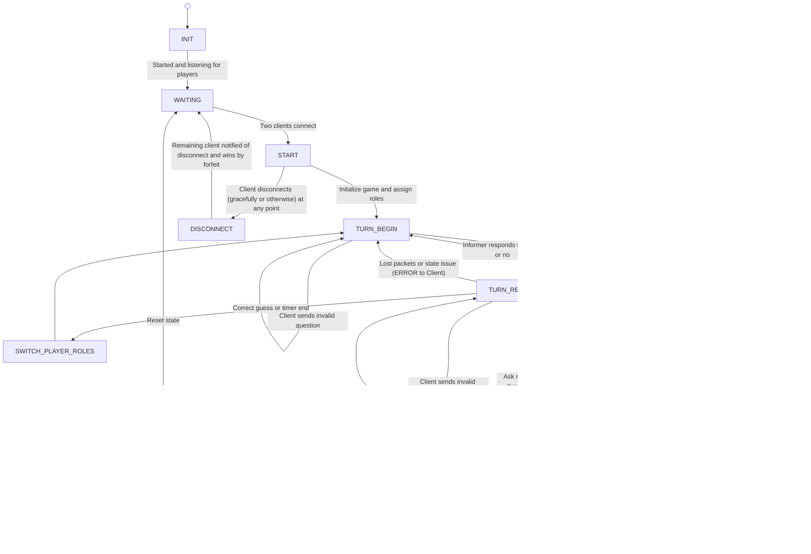

### Game State Machine (FSM) Design

```mermaid
flowchart TD
    A@{ shape: sm-circ, label: "Small start" } --> INIT
    -- Started and listening for players --> WAITING
    -- Two clients connect --> START
    -- Initalize game and assign roles --> TURN_BEGIN
    -- Guesser sends yes or no question --> TURN_RESPONSE
    -- Informer responds with yes or no --> TURN_BEGIN
    TURN_RESPONSE -- Lost packets or state issue (ERROR to Client) --> TURN_BEGIN
    TURN_RESPONSE -- Win detected --> END
    TURN_RESPONSE -- Correct guess or timer end --> SWITCH_PLAYER_ROLES
    --> TURN_BEGIN
    TURN_BEGIN -- Client sends invalid question --> TURN_BEGIN
    TURN_RESPONSE -- Client sends invalid response --> TURN_RESPONSE
    TURN_RESPONSE -- Draw detected --> VICTORY_ROUND
    -- Server asks victory question --> VICTORY_QUESTION
    -- Clients guess victory question answer --> VICTORY_ROUND
    VICTORY_QUESTION -- Ask new question after three rounds with no correct guess --> VICTORY_ROUND
    VICTORY_QUESTION -- Client breaks draw by guessing correctly --> END
    -- Broadcast final score --> CLEAN_UP
    -- Reset state --> WAITING
    START -- Client disconnects (gracefully or otherwise) at any point --> DISCONNECT 
    -- Remaining client notified of disconnect and wins by forfeit --> WAITING 
```